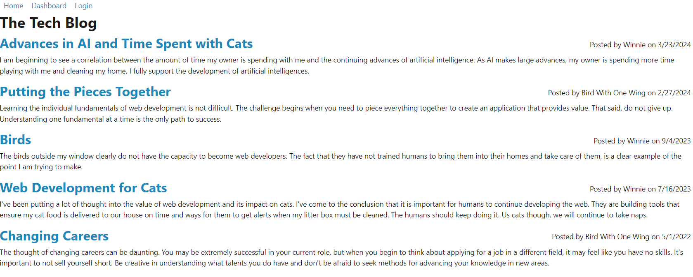
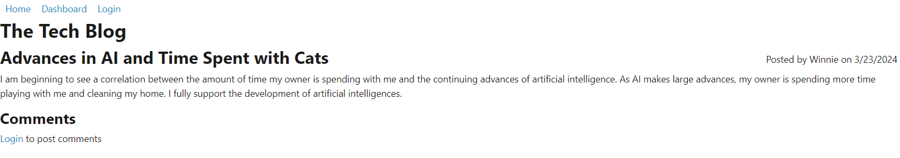
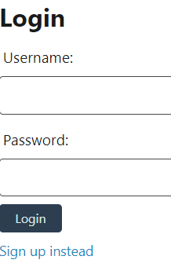
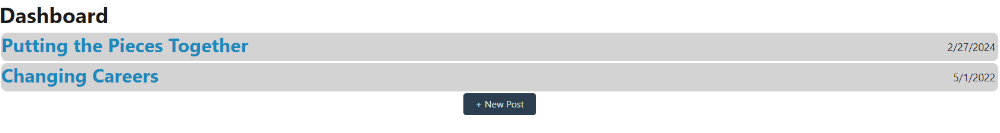
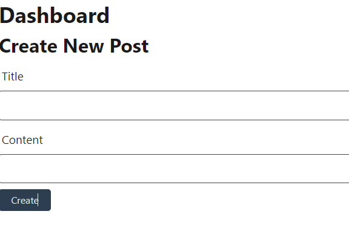
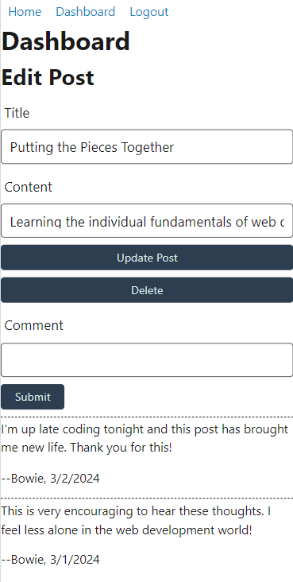

# tech-blog

## Description

CMS-style blog site where developers can publish posts and comment on other developers' content as well.

- This was my first project utilizing a templating engine. I found working with Handlebars.js to be very intuitive and valuable as a more efficient way to dynamically render HTML to the DOM.  
- I felt much more confident in setting up the database scheme using Sequalize as the ORM.  Defining the associations between models came much more naturally.  I am satisfied with the integrity of the database.
- Authentication was a bit tricky for me and further testing is required to confirm if there are any bugs related to session timeouts and how the appliction responds.
- The application could use refined error handling to better inform the user if an operation is not successful. 

## Table of Contents

- [Deployment](#deployment)
- [Usage](#usage)
- [License](#license)
- [Questions](#questions)

## Deployment

Here is the [Deployed Application](https://tech-blog-sg2l.onrender.com/) hosted by [Render](https://render.com/) cloud infrastructure.

*NOTE: The free tier of Render's web services incorporates spinning down on idle.  See below for how this impacts this application.*

Render Documentation

[Spinning Down on Idle](https://docs.render.com/free#spinning-down-on-idle) - "Your free instance will spin down with inactivity, which can delay requests by 50 seconds or more."

"Render spins down a Free web service that goes 15 minutes without receiving inbound traffic. Render spins the service back up whenever it next receives a request to process."

"Spinning up a service takes a few seconds, which causes a noticeable delay for incoming requests until the service is back up and running. For example, a browser page load will hang momentarily."

WHAT THIS MEANS: The application will likely take a minute to load when you first navigate to it.  Request times will be faster after that.  

## Usage

Here is the [Code Repository](https://github.com/briandwach/tech-blog).

- When the page loads, the homepage will display the 5 most recent posts created by users.

  

- You can freely click the posts and view comments without authenticating as a user.

  

- Attempting to navigate to the Dashboard will prompt you to login or signup.

  

- Once you are logged in, you will be directed to your Dashboard where you can create a new post and view previously created posts. 

  

  

- Click on a previously created post to update it or delete it.

  

- When you are logged in, you can comment on other users' posts.  If you are idle for more than 10 minutes, you will have to re-login to the application.

## License
This application is covered under the [MIT License](http://choosealicense.com/licenses/mit/).

## Questions
Please email me with any questions regarding this application at: brian.d.wach@gmail.com

Additionally, checkout more of my work on GitHub: [briandwach](https://github.com/briandwach)